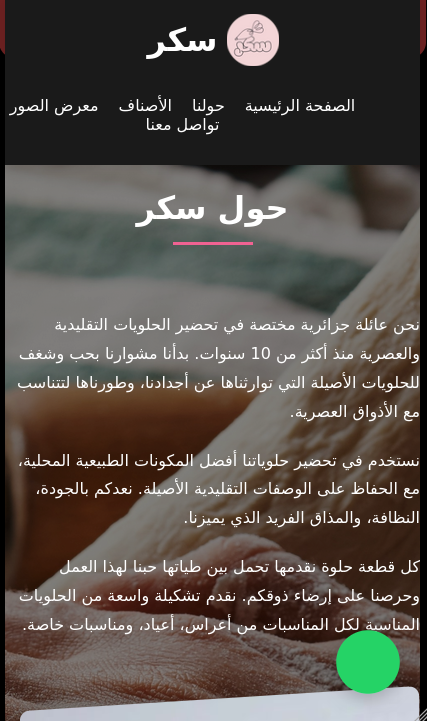
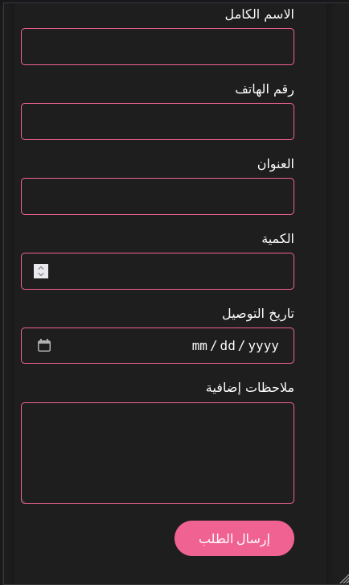
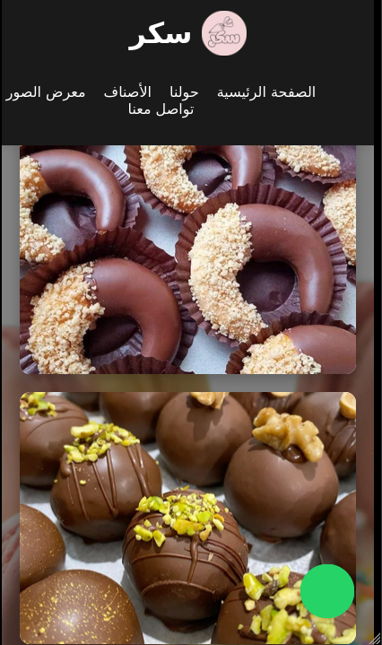
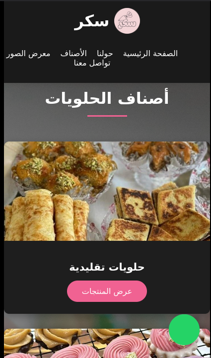

# 🍬 SOKOR - Algerian Traditional & Modern Sweets Website

🌐 [Visit Live Website](https://sokor.onrender.com)

Welcome to **SOKOR**, an elegant and emotionally rich online experience, born from a passionate Algerian family business dedicated to crafting traditional and modern sweets for over 10 years.

> "Desserts are not just a taste — they are memories." — Mama Fatima 👵💖

## 🌟 Features

- 🇩🇿 Full Arabic RTL layout with modern responsive design
- 📱 Mobile-first optimized experience
- 🧁 Product categorization (Traditional, Modern, Wedding, Ramadan, Kids...)
- 🛒 Dynamic product display with modal ordering system
- 🎁 Surprise gift for every order over 2000 DZD
- 🧠 Family story, heritage, and emotional brand storytelling
- 📞 WhatsApp integration for direct orders
- 🌙 Dark mode / Light mode toggle
- 🖼️ Photo gallery and weekly offers carousel
- 📦 Built with pure HTML, CSS (with animations), and minimal JS

## 🛠️ Tech Stack

- HTML5 + Semantic Tags
- CSS3 (Flexbox, Grid, Animations)
- JavaScript (vanilla)
- Responsive Design (Media Queries)
- WhatsApp API Integration

## 📸 Preview

Below are key screenshots from the project (from `static/images-2/`):






## 🚀 Getting Started

To view the website locally:

```bash
git clone https://github.com/Ashref2004/Sokor
cd sokor-website
open index.html
```

## 📂 File Structure

```
📁 sokor-website
├── 📄 index.html
└── 📁 static
    ├── 📁 css
    │   └── style.css
    ├── 📁 images
    │   └── [All product & UI images]
    ├── 📁 images-2
    │   ├── about.png
    │   ├── forms.png
    │   ├── gallery.png
    │   └── type.png
    └── 📁 js
        └── script.js

```

## 🔮 Future Plans

- 🔍 Product search and filtering
- 🌐 Multilingual support (French, English)
- 🧾 Order tracking system
- 🧬 Connect to a backend with database (Coming soon)
- 🧪 Admin dashboard for managing products and orders

## ❤️ Made With Love

This project was handcrafted for a family-run sweets business in Algeria. Every line of code was written with deep respect for tradition, warmth, and delicious experiences.

## 💡 Notes

This is a **free version**, open to everyone, and currently **under development**. Contributions or suggestions are welcome!

## 📞 Contact

For support, collaboration, or custom projects:

**WhatsApp:** [+213 782675199](https://wa.me/213782675199)

---

# 🍬 سُكَّر - موقع الحلويات التقليدية والعصرية الجزائرية

🌐 [رابط الموقع المباشر](https://sokor.onrender.com)

مرحبًا بك في **سُكَّر**، تجربة رقمية راقية وغنية بالمشاعر، من عائلة جزائرية شغوفة بصناعة الحلويات التقليدية والعصرية منذ أكثر من 10 سنوات.

> "الحلويات ليست فقط مذاق، بل ذكريات تبقى في القلب" — أمّنا فاطمة 👵💖

## 🌟 المميزات

- 🇩🇿 واجهة كاملة باللغة العربية (من اليمين لليسار)
- 📱 تصميم متجاوب مع شاشات الهاتف
- 🧁 تصنيف المنتجات (تقليدية، عصرية، رمضان، أطفال...)
- 🛒 عرض ديناميكي للمنتجات مع نظام طلب مباشر (modal)
- 🎁 هدية مفاجئة لكل طلب يفوق 2000 دج
- 🧠 قصة عائلية وتراث وروح إنسانية في التصميم
- 📞 تكامل مع واتساب للطلبات
- 🌙 دعم الوضع الداكن والفاتح
- 🖼️ معرض صور وعروض أسبوعية
- 📦 مبني بلغة HTML وCSS مع تأثيرات بصرية جميلة

## 🛠️ التكنولوجيات المستعملة

- HTML5 و CSS3
- JavaScript خفيف (vanilla)
- تصميم متجاوب (Media Queries)
- دمج API الخاص بواتساب

## 📸 صور من الواجهة

صور توضيحية من الواجهة (من مجلد `images-2`):


## 🚀 طريقة التشغيل

لعرض الموقع على جهازك:

```bash
git clone https://github.com/Ashref2004/Sokor
cd sokor-website
open index.html
```

## 📂 بنية المشروع

```
📁 sokor-website
├── 📄 index.html
└── 📁 static
    ├── 📁 css
    │   └── style.css
    ├── 📁 images
    │   └── [All product & UI images]
    ├── 📁 images-2
    │   ├── about.png
    │   ├── forms.png
    │   ├── gallery.png
    │   └── type.png
    └── 📁 js
        └── script.js

```

## 🧩 قيد التطوير

- 🔍 خاصية البحث والفلترة
- 🌐 دعم تعدد اللغات (فرنسية، إنجليزية)
- 🧾 نظام تتبع الطلبات
- 🧬 ربط مع قاعدة بيانات في المستقبل
- 🧪 لوحة تحكم للإدارة

## ❤️ مصنوع بكل حب

تم تصميم هذا المشروع يدويًا بحب كبير لعائلة جزائرية تتقن فن الحلويات. كل سطر كود كُتب بروح الأصالة والذوق الرفيع.

## 💡 ملاحظات

هذا الإصدار مجاني ومفتوح للجميع، والعمل عليه لا يزال جاريًا. مرحبًا بأي مساهمة أو اقتراح.

## 📞 للتواصل

**واتساب:** [+213 782675199 ](https://wa.me/213782675199)
